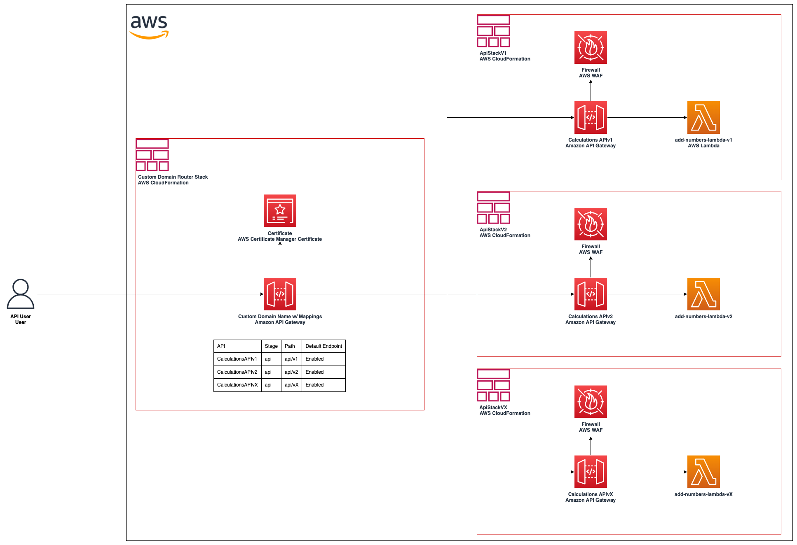
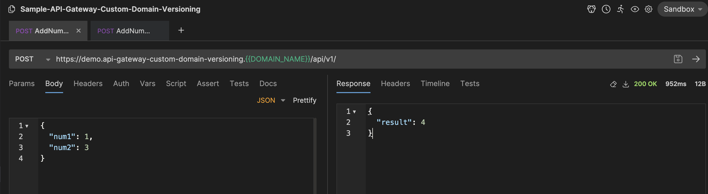
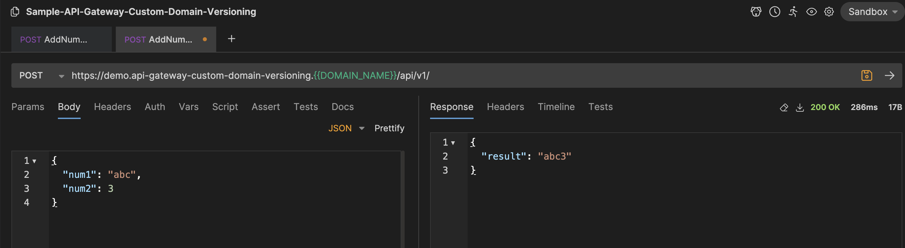
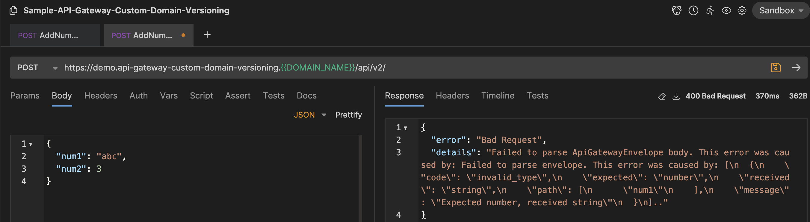

# Amazon API Gateway Path-Based Versioning

This is a sample repository on how to scalably implement versioning within Amazon API Gateway. This approach uses the Amazon API [Gateway Custom Domain](https://docs.aws.amazon.com/apigateway/latest/developerguide/how-to-custom-domains.html) feature to implement path based routing to versioned API's.



## Table of Contents

- [Important Design Considerations](#important-design-considerations)
- [How to use this Sample Repo](#how-to-use-this-sample-repo)
  - [Prerequisites](#prerequisites)
  - [Deploying the Sample Application](#deploying-the-sample-application)
    - [About the Sample Application](#about-the-sample-application)
    - [Step-by-Step Instructions](#step-by-step-instructions)
    - [Testing your Sample API](#testing-your-sample-api)
    - [Important Security Considerings Regarding the Sample Implementation](#important-security-considerings-regarding-the-sample-implementation)
- [Contributing](#contributing)
- [License](#license)

## Important Design Considerations

This approach:

- Allows for versions to be deployed or removed independently (each API Version is a separate CloudFormation stack)
- Scales to 200 live versions (AWS quota, cannot be increased)
- Is completely serverless (pay as you go, scales to 0)
- Integrates with virtually any backend (AWS Lambda, Fargate, EC2, AWS Service Integrations, etc.)

## How to use this Sample Repo

This repository has an example implementation of the recommended approach to implement path based versioning with Amazon API Gateway. This repository can be utilized to deploy a sample proof-of-concept to explore the design and understand any limitations.

### Prerequisites

Deployment of this sample implementation and the use of the Amazon API Gateway Custom Domain feature _requires ownership of a domain_. Going through the process of purchasing ownership of a public domain is not in scope of this repository. In order to utilize this sample repository or use the Amazon API Gateway Custom Domain functionality, you must own a domain. We recommend Amazon Route 53 to create and manage your domains. More details on how to register or transfer a domain into Amazon Route 53 can be found [here](https://docs.aws.amazon.com/Route53/latest/DeveloperGuide/domain-register-update.html).

### Deploying the Sample Application

#### About the Sample Application

See the architecture diagram for which resources are included in the deployment of the sample application.

The sample application includes 3 stacks:

| Stack                   | Description                                             | Command to Deploy        |
| ----------------------- | ------------------------------------------------------- | ------------------------ |
| CustomDomainRouterStack | Creates an ACM Certificate and Custom Domain Resource   | `npm run deploy-routing` |
| ApiStackV1              | V1 API with a API Mapping for paths that include api/v1 | `npm run deploy-v1`      |
| ApiStackV2              | V2 API with a API Mapping for paths that include api/v2 | `npm run deploy-v2`      |

#### Step-by-Step Instructions

1. Clone the repository
2. Install dependencies `npm install`
3. Deploy the CustomDomainRouterStack CloudFormation Stack `npm run deploy-routing`
   - This deployment will remain a status of IN_PROGRESS until you validate the domain ownership by creating the appropriate CNAME records. More Information [here](https://docs.aws.amazon.com/acm/latest/userguide/dns-validation.html)
4. Deploy ApiStackV1 CloudFormation Stack `npm run deploy-v1`
5. Deploy ApiStackV1 CloudFormation Stack `npm run deploy-v2`
6. Invoke your API [See Testing your Sample API for more Details.](#Testing-your-Sample-API)

#### Testing your Sample API

We recommend using the open-source API testing tool known as (Bruno)[https://www.usebruno.com/]. A sample collection is provided to facilite testing your Sample API. Follow these steps to invoke your API.

1. [Install Bruno.](https://www.usebruno.com/downloads)
2. Open Bruno.
3. Open Collection provided in this repository (Select folder "Sample-API-Gateway-Custom-Domain-Versioning under the Bruno folder).
4. Select any request in the collection to bring up the "Environments" dropdown in the top right of the UI.
5. In the Environments dropdown, select "Configure".
6. Update the REPLACE_ME_WITH_YOUR_DOMAIN value with your custom domain.
7. Hit Save and Close the Configuration Section.
8. Ensure the Sandbox Environment is Active (selected).
9. Invoke your API using the '->' button for the selected request.
10. Take note on how Validation (passing in non-number values) is handled in V1 compared to V2.

Example API Invocation with Bruno:


V1 (lack of) Validation Example:


V2 (implemented) Validation Example:


#### Important Security Considerings Regarding the Sample Implementation

The sample CDK application uses CDK nag with AWSSolutionsChecks to help improve security. However, some CDK issues are suppressed in order to keep the sample proof-of-concept application simple to use. _These suppressions should be remediated before use in a production-ready implementation._

These suppressions include:

```typescript
// lib/constructs/nodejsFunctionWithRole.ts
NagSuppressions.addResourceSuppressions(
  this,
  [
    {
      id: "AwsSolutions-IAM5",
      reason:
        "The Lambda Execution Role Policy needs to include a * permissions to enable Cloudwatch Logging and X-Ray Tracing.",
    },
  ],
  true
);

// lib/apiStackV1.ts and lib/apiStackV2.ts
NagSuppressions.addResourceSuppressions(
  this.lambdaRestApi,
  [
    {
      id: "AwsSolutions-APIG2",
      reason: "Request Validation is handled by the Backend Lambda function.",
    },
    {
      id: "AwsSolutions-APIG3",
      reason:
        "This API does not implement a WAF Firewall integration as it is used for demo sample implementation purposes only. Adding a firewall would add complexity to the sample proof of concept exercise. Consider adding an AWS WAF Firewall integration before using Amazon API Gateway in a production use-case.",
    },
    {
      id: "AwsSolutions-APIG4",
      reason:
        "This API does not implement authorization as it is used for demo sample implementation purposes only. Adding authorization would add complexity to the sample proof of concept exercise. Ensure authorization is implemented before using Amazon API Gateway in a production use-case.",
    },
    {
      id: "AwsSolutions-COG4",
      reason:
        "This API does not implement authorization as it is used for demo sample implementation purposes only. Adding authorization would add complexity to the sample proof of concept exercise. Ensure authorization is implemented before using Amazon API Gateway in a production use-case.",
    },
  ],
  true
);
```

## Contributing

See details in [CONTRIBUTING.md](./CONTRIBUTING.md)

## License

See details in [LICENSE](./LICENSE)
